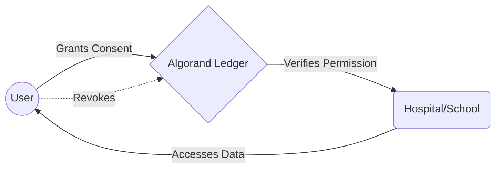

# ConsentChain 🧬: The Simplified Guide

Welcome to the future of data sovereignty! This guide explains how **ConsentChain** works in plain English, broken down by the three main players in the ecosystem.

---

## 👤 1. The User: "The Sovereign Owner"
**In simple terms:** You are the boss of your data. You don't just "trust" a website; you grant them a digital key that you can take back at any time.

### How it works for you:
*   **Decide & Sign**: When a site asks for your data, you use your **Blockchain Wallet** (like Pera) to sign a digital contract. 
*   **The Kill Switch**: Your dashboard has a big red **"Revoke"** button. The moment you click it, the connection is physically erased from the blockchain. No "Please wait 30 days for processing"—it happens **now**.

> [!TIP]
> **Why it's better**: In a normal app, if you "delete" your account, you just have to trust the company actually deleted your data. In ConsentChain, you delete the **permission record** yourself on the public ledger.

---

## 🤖 2. The Software: "The Secret Sauce"
**In simple terms:** We take complicated blockchain logic and turn it into a fast, cheap, and unbreakable system.

### How the backend magic works:
*   **Boxes 📦**: We use Algorand "Boxes"—tiny, ultra-secure lockers on the blockchain. They are specialized for high-speed lookups.
*   **Compression 🤐**: Blockchain storage is like a tiny suitcase. We can't fit a whole page of text, so we turn "Access my medical records for heart research until next year" into a tiny code like `{"s":"med","p":"res","e":"2027"}`.
*   **Atomic Grouping ⚛️**: We bundle your "Permission" and the "Storage Fee" into one single transaction. This ensures that either the whole thing works perfectly, or nothing happens at all (preventing errors).

---

## 🏥 3. The Operator: "The Verified Partner"
**In simple terms:** Organizations (like Hospitals or Schools) stop being "data hoarders" and start being "data borrowers."

### How it works for them:
*   **The Handshake 🤝**: When you visit their site, the hospital doesn't ask its own database if you're allowed in. It asks the **Algorand Ledger**.
*   **Zero-Trust**: The operator's site (using our SDK) checks for your specific "Box" on the blockchain. 
    *   **Found?** ✅ Access granted automatically.
    *   **Missing/Expired?** ❌ Access denied instantly.

> [!IMPORTANT]
> **No More Leaks**: Since the operator only has access as long as your "Box" exists, they have no reason to keep copies of your data forever. This drastically reduces the impact of data breaches.

---

## 🔄 The Ecosystem Journey

---

### Comparison: Old Way vs. ConsentChain Way

| Feature | The Old Way (Web2) | ConsentChain Way (Web3) |
| :--- | :--- | :--- |
| **Storage** | Company's Private Server | Public Immutable Ledger |
| **Control** | "Request to Delete" (Email/Form) | **Direct Revocation** (Blockchain TX) |
| **Trust** | "Trust us, we're a big bank" | "Trust the Math & Cryptography" |
| **Transparency** | Hidden Audit Logs | **Real-time Security Stream** |

---

*“Data sovereignty isn’t a luxury; it’s a standard. Built with 🧬 ConsentChain.”*
