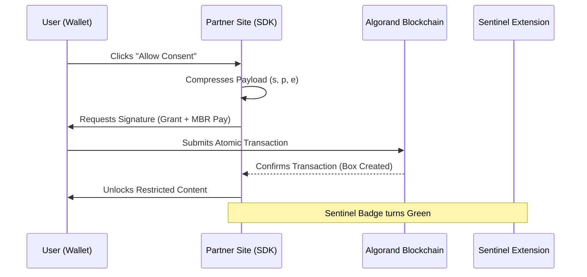
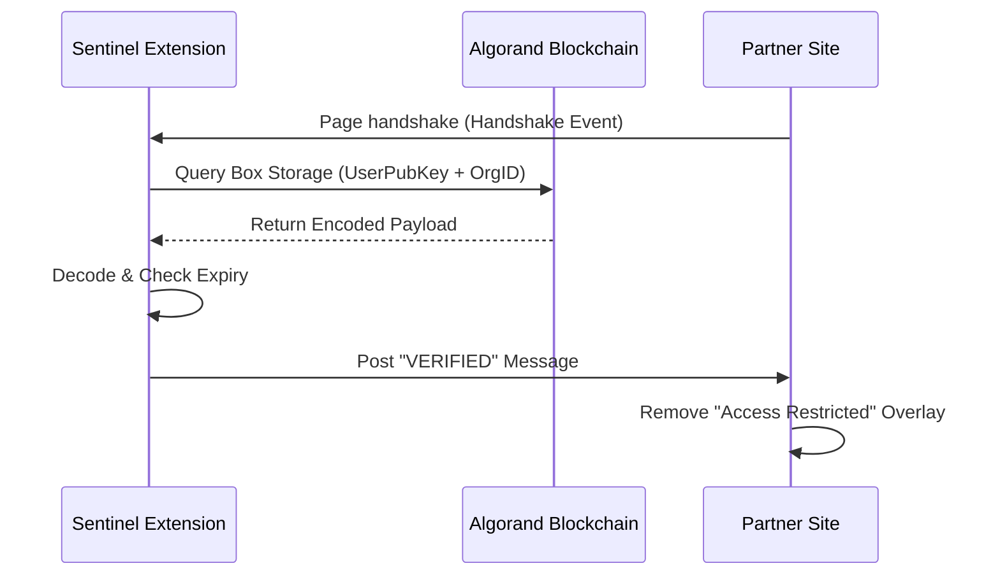

# ConsentChain 🧬: The Master Specification

> **Immutable Data Sovereignty. Cryptographic Trust. Seamless Integration.**

ConsentChain is a next-generation decentralized consent management ecosystem. Built for the **AlgoBharat** initiative, it empowers users with absolute sovereignty over their digital footprint while providing organizations with a frictionless, zero-trust verification infrastructure.

---

## 💎 The Vision: Immutable Data Sovereignty

In an era of opaque data harvesting, ConsentChain introduces **The Transparency Protocol**. We move beyond simple "check-boxes" to a world where every permission is a cryptographically signed, on-chain record.

- **Sovereign Control**: Users own their consent, stored in their own local blockchain state.
- **Radical Transparency**: A public, immutable audit trail of who has access to what, and for how long.
- **Zero-Knowledge Ready**: Architectural foundations prepared for ZK-proofs to ensure data privacy without sacrificing auditability.

---

## 🛡️ Core Pillars of Trust (Key Features)

### 1. The Sentinel Protocol (Browser Extension)
The **Trust Guardian** of the ecosystem. Sentinel lives in your browser, performing invisible, real-time cryptographic handshakes with partner websites.
- **Auto-Unlock**: Automatically detects your on-chain permissions and unlocks restricted data without manual login.
- **On-Chain Polling**: Continuously verifies that your consent hasn't expired or been revoked.
- **Identity Sync**: One-click synchronization between your wallet and your browser profile.

### 2. The Security Vault (User Dashboard)
A sophisticated **Command Center** for your digital rights.
- **Live Audit Stream**: A real-time terminal feed of blockchain events affecting your security.
- **Consent Map**: A visual topology of organizations authorized to access your data.
- **Instant Revocation**: Real-time, atomic transactions to strip access from any organization instantly.

### 3. Universal SDK & Widget
A **Developer-First Gateway** that turns complex blockchain logic into a single line of code.
- **ConsentWidget**: A premium, "drop-in" UI component for React/Next.js.
- **Zero-Trust Verification**: Programmatic API to verify user status directly from the Algorand ledger.

---

## 🏗️ The Intelligence Layer (Technical Architecture)

ConsentChain is built on a high-performance, modular stack designed for speed and security.

### 1. The Frontend Engine
- **Framework**: Next.js 15 (React 19)
- **Styling**: Tailwind CSS 4.0 with customized "Glassmorphism" UI tokens.
- **Animations**: Framer Motion for micro-interactions and "alive" interface elements.

### 2. The Blockchain Backbone
- **Protocol**: Algorand (Testnet)
- **Smart Contracts**: TEAL v8 approval and clear programs.
- **Storage Strategy**: 
    - **Box Storage**: Used for scalable, unbounded `(User + Org)` mappings.
    - **Local State**: Legacy-compatible storage for specific user metadata.
- **Atomic Transactions**: Groups of transactions (MBR payment + App Call) to ensure state integrity.

### 3. The Middleware SDK
- **Core**: `ConsentChainSDK` written in TypeScript.
- **Key Functions**:
    - `prepareGrant()`: Calculates Minimum Balance Requirements (MBR) and constructs atomic groups.
    - `verifyConsent()`: Queries Algod/Indexer nodes and decodes compressed payloads.
    - `prepareRevoke()`: Constructs state-clearing transactions.

---

## 🔄 System Architecture & Flows

### User Consent Lifecycle

### Automated Verification Flow

---

## 📜 Smart Contract Specification

The heart of ConsentChain is a robust TEAL contract handling state transitions with cryptographic precision.

| Method | Arguments | Storage Action | Logic |
| :--- | :--- | :--- | :--- |
| `Grant` | `OrgID`, `Payload` | `box_put` | Validates transaction group, calculates MBR, and stores compressed JSON. |
| `Revoke` | `OrgID` | `box_del` | Deletes the unique box associated with the User and Organization. |
| `Sync` | `Address` | `app_local_put` | (Optional) Stores cross-device metadata in user local state. |

---

## 🚀 Future Evolution (Roadmap)

1. **V2 Scale**: Migration to pure Box Storage for 100% unbounded organization support.
2. **Privacy Enhancement**: Integration of **Zero-Knowledge Proofs (ZKP)** to prove "Consent Exists" without revealing the "Data Scope" to the public ledger.
3. **Cross-Chain Identity**: Bridging consent proofs to other AVM-compatible networks.
4. **Mobile Guardian**: Dedicated iOS/Android app for on-the-go consent management.

---

> [!TIP]
> **Pro-Tip for Developers**: When integrating the SDK, always use the `compressPayload` utility. Algorand Box storage is efficient but limited to 128-byte segments for optimized performance.

---

*Generated by ConsentChain AI Architect - 2026*
