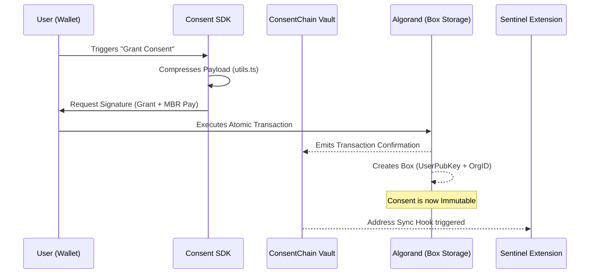
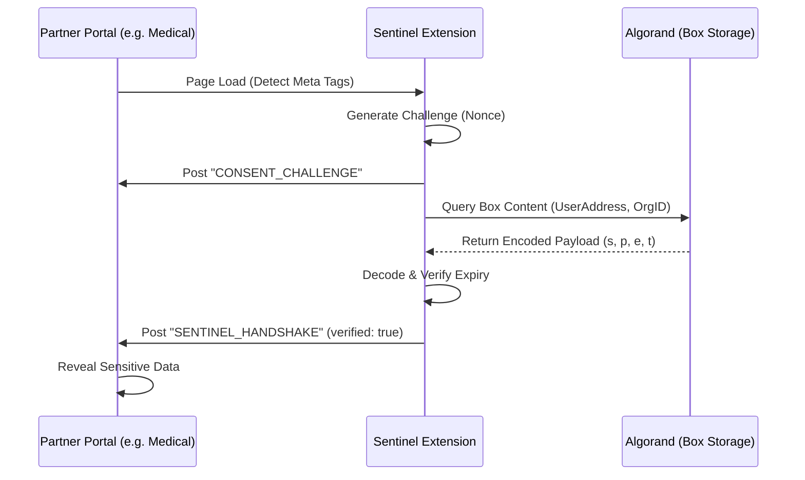
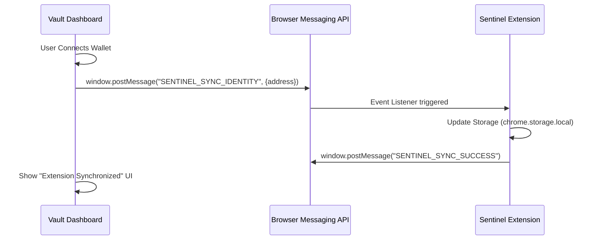

# 📊 ConsentChain Architecture Visuals

This document provides a visual representation of how data and signals flow within the ConsentChain ecosystem.

## 1. Consent Grant Flow
This flow describes the process from a user clicking "Grant" on a partner site to the state being updated on the Algorand blockchain.

## 2. Sentinel Verification Flow
This describes how the browser extension automatically verifies a user's consent status when they visit a partner portal.

## 3. Universal Identity Sync Flow
How the Vault securely informs the extension of the current user's wallet address without requiring a specific Extension ID.

---

## Technical Details

- **Box Storage**: Used for 1-to-N organization mapping. Each box is exactly `32 (User) + variable (OrgID)` bytes long.
- **Payload Compression**: JSON keys are mapping as follows:
  - `s`: Scopes (comma-separated string)
  - `p`: Purpose (string)
  - `e`: Expiry (Unix timestamp)
  - `t`: Timestamp (Unix timestamp of grant)
